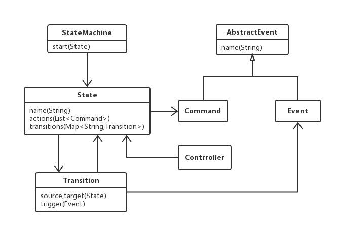
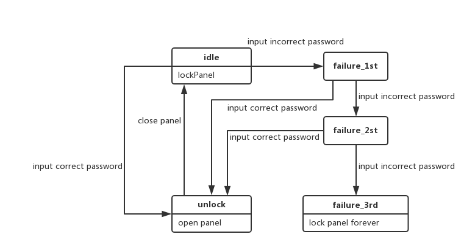
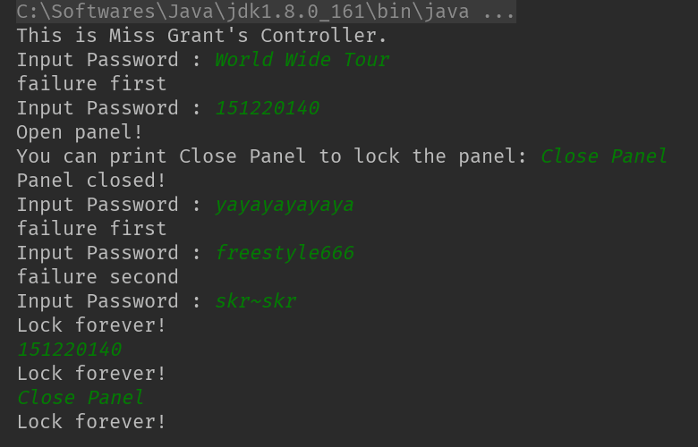

# 格兰特小姐定的密室控制系统

## 1. 需求背景
参考Martin Fowler《领域特定语言》书中“格兰特小姐的密室控制系统”示例，用Java语言构造一个有限状态机语言，然后再利用该状态机语言构造一个密室控制系统。

具体要求：
1. 密室的控制不使用灯和抽屉等，而改为使用数字控制面板，只有数字和确认键；
2. 输入正确的密码按确认键，输出“密室打开”的信息，输入3次错误，则输入“密室永久封闭”的信息；

## 2. 状态机语言元模型图

## 3. 密室控制状态图

## 4. 代码说明
### 4.1 状态机模型部分
```
public class AbstractEvent {
    private String name;

    public AbstractEvent(){
    }

    public String getName() {
        return name;
    }

    public void setName(String name) {
        this.name = name;
    }
}

public class Event extends AbstractEvent {
    public Event(){
        super();
    }
}

public class Command extends AbstractEvent {
    public Command(){
        super();
    }
}
```
`AbstractEvent`是`Event`和`Command`的父类，其有一个`name`变量做为唯一标识，`Event`和`Command`都是`AbstractEvent`的子类，其中`Event`类为状态机中所有造成状态变化的外部操作的抽象，`Command`类为状态机中所有状态变化后导致的内部操作的抽象。
```
public class State {
    private String name;
    private List<Command> actions = new ArrayList<Command>();
    private Map<String,Transition> transitions = new HashMap<String, Transition>();

    public State(String name){
        this.name = name;
    }

    public String getName() {
        return name;
    }

    public void addAction(Command action){
        actions.add(action);
    }

    public void addTransition(Event event,State targetState){
        assert null != targetState;
        transitions.put(event.getName(),new Transition(this,event,targetState));
    }

    public boolean hasTransition(String eventName){
        return transitions.containsKey(eventName);
    }

    public State targetState(String eventName){
        return transitions.get(eventName).getTarget();
    }

}
```
`State`类为状态机中的某个状态的抽象，其含有`name`作为唯一标识，同时有一个`actions`变量存放该状态中所有的`Command`对象，还有一个`transitions`变量记录所有可能的状态转换。
```
public class StateMachine {
    private State state;

    public StateMachine(State state){
        this.state = state;
    }

    public State getState(){
        return state;
    }

    public void setState(State state){
        this.state = state;
    }
}
```
`StateMachine`为状态机模型的初步抽象，这里对书上内容做了适当简化，其含有一个`state`变量，设置了相应方法可以获取和改变状态机状态。
```
public class Transition {
    private final State source,target;
    private final Event trigger;

    public Transition(State source,Event trigger,State target){
        this.source = source;
        this.trigger = trigger;
        this.target = target;
    }

    public State getTarget() {
        return target;
    }
}
```
`Transition`为状态转换的抽象，含有变量`source`、`target`和`trigger`，分别表示原状态、目标状态和转换事件。
```
public class Controller {

    public State handle(State currentState,String eventName){
        if(currentState.hasTransition(eventName)){
            return currentState.targetState(eventName);
    }
    else
        return currentState;
    }
}
```
`Controller`为控制模块，这里也做了部分简化，主要保留了状态转化模块，输入原状态和转换条件，如果判断转换成立，则返回转换后的状态。
### 4.2 密室控制系统部分
```
public class MissGrantController {
    private Controller controller = new Controller();

    Event inputIncorrectPassword = new Event();
    Event inputCorrectPassword = new Event();
    Event closePanel = new Event();

    Command lockPanelCmd = new Command();
    Command openPanelCmd = new Command();
    Command lockPanelForeverCmd = new Command();

    State idle = new State("idle");
    State failure_1stState = new State("faliure_1st");
    State failure_2ndState = new State("failure_2nd");
    State failure_3rdState = new State("failure_3rd");
    State unlockPanelState = new State("unlockPanel");

    StateMachine machine = new StateMachine(idle);

    public MissGrantController(){
        inputIncorrectPassword.setName("inputIncorrectPassword");
        inputCorrectPassword.setName("inputCorrectPassword");
        closePanel.setName("closePanel");

        lockPanelCmd.setName("lockPanel");
        openPanelCmd.setName("openPanel");
        lockPanelForeverCmd.setName("lockPanelForever");

        idle.addTransition(inputCorrectPassword,unlockPanelState);
        idle.addTransition(inputIncorrectPassword,failure_1stState);
        idle.addAction(lockPanelCmd);

        failure_1stState.addTransition(inputCorrectPassword,unlockPanelState);
        failure_1stState.addTransition(inputIncorrectPassword,failure_2ndState);

        failure_2ndState.addTransition(inputCorrectPassword,unlockPanelState);
        failure_2ndState.addTransition(inputIncorrectPassword,failure_3rdState);

        failure_3rdState.addAction(lockPanelForeverCmd);

        unlockPanelState.addAction(openPanelCmd);
        unlockPanelState.addTransition(closePanel,idle);
    }

    public void handle(Event event){
        machine.setState(controller.handle(machine.getState(),event.getName()));
    }
}
```
用状态机模型领域专用语言构造出的密室控制系统状态机。
```
public class View {
    private MissGrantController missGrantController = new MissGrantController();
    private static String PASSWORD = "151220140";
    private static String CLOSEPANEL = "Close Panel";

    private void handleInput(String input){
        if(input.equals(PASSWORD))
            missGrantController.handle(missGrantController.inputCorrectPassword);
        else if(input.equals(CLOSEPANEL))
            missGrantController.handle(missGrantController.closePanel);
        else
            missGrantController.handle(missGrantController.inputIncorrectPassword);
    }

    public static void main(String[] args){
        System.out.println("This is Miss Grant's Controller.");
        System.out.print("Input Password : ");
        Scanner scanner = new Scanner(System.in);
        View view = new View();
        while(true){

            String input = scanner.nextLine();
            if(input.equals("exit"))
                break;
            view.handleInput(input);
            if(view.missGrantController.machine.getState().getName().equals(view.missGrantController.failure_1stState.getName())) {
                System.out.println("failure first");
                System.out.print("Input Password : ");
            }
            else if(view.missGrantController.machine.getState().getName().equals(view.missGrantController.failure_2ndState.getName())) {
                System.out.println("failure second");
                System.out.print("Input Password : ");
            }
            else if(view.missGrantController.machine.getState().getName().equals(view.missGrantController.failure_3rdState.getName()))
                System.out.println("Lock forever!");
            else if(view.missGrantController.machine.getState().getName().equals(view.missGrantController.unlockPanelState.getName())) {
                System.out.println("Open panel!");
                System.out.print("You can print Close Panel to lock the panel: ");
            }
            else if(view.missGrantController.machine.getState().getName().equals(view.missGrantController.idle.getName())) {
                System.out.println("Panel closed!");
                System.out.print("Input Password : ");
            }
        }
    }
}
```
程序的入口，主要处理输入输出内容。
## 5. 执行结果


如图所示，先输入错误密码，无法解锁；输入正确密码`151220140`，解锁成功；输入`Close Panel`关闭密室（这里用输入指令模拟了关闭密室的操作），随后输入错误密码三次，密室永远锁住，此时再输入正确密码或者关闭指令都不会再有正确响应。